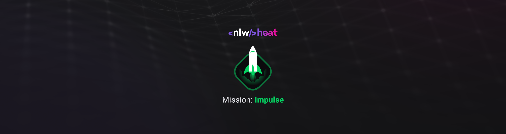
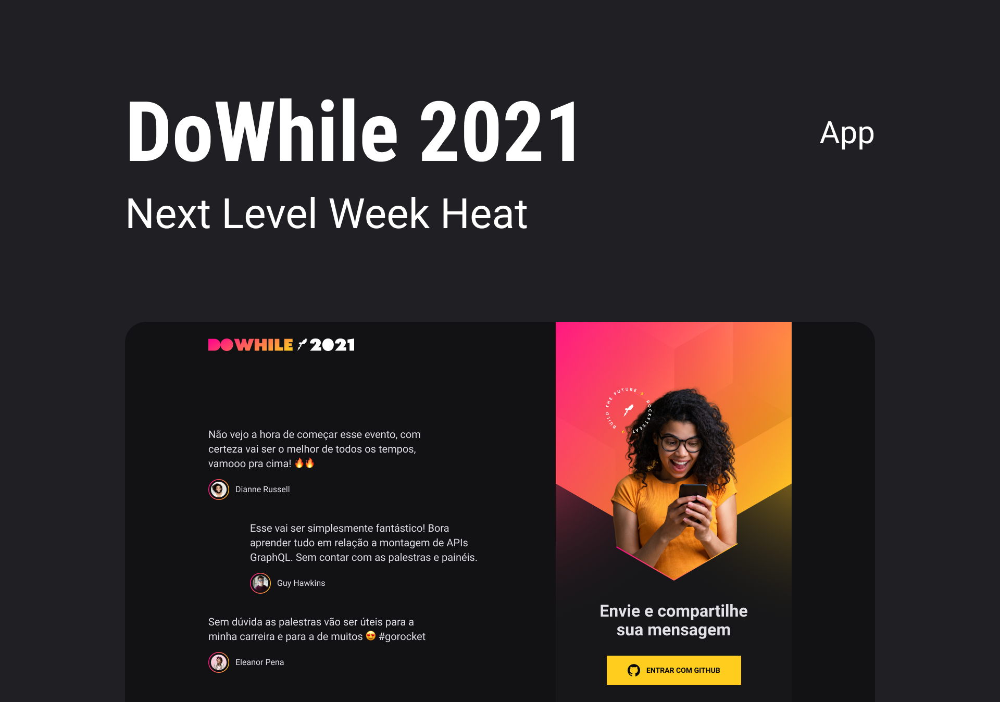
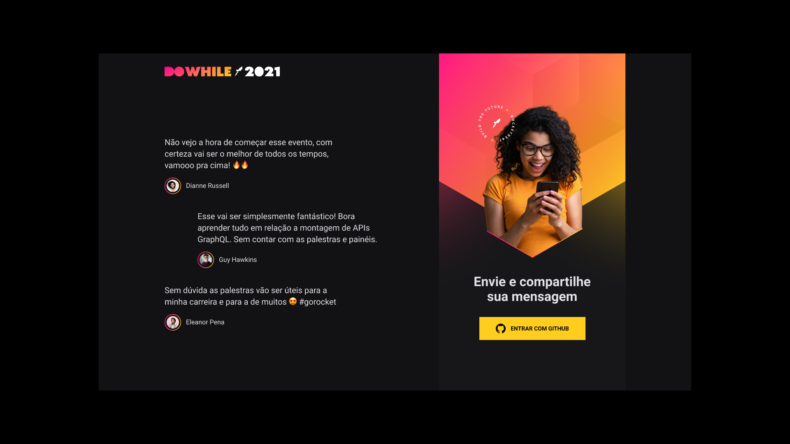
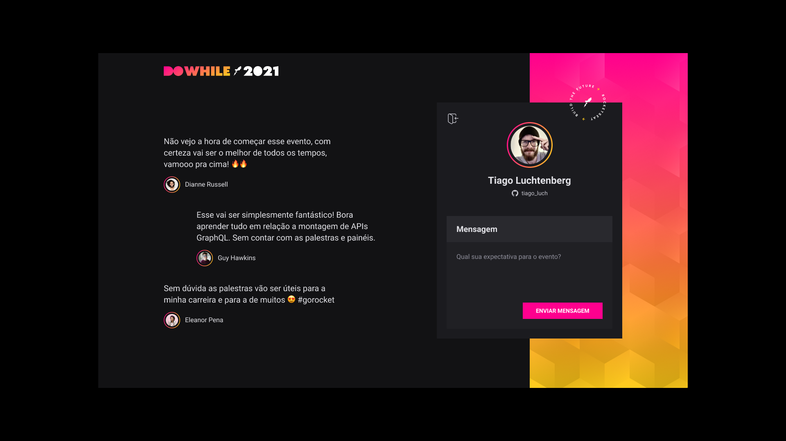
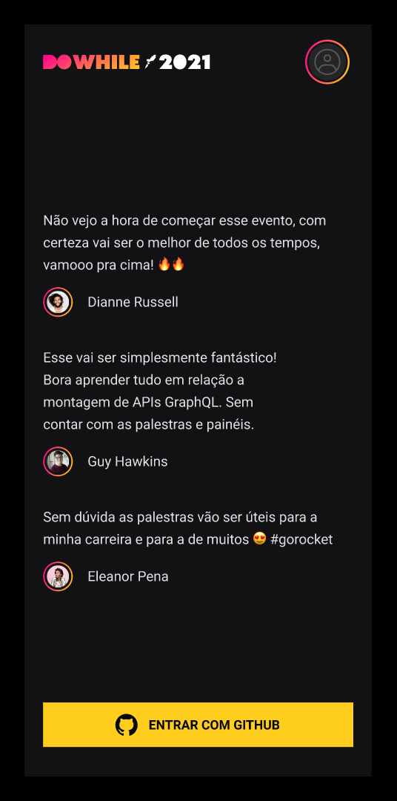
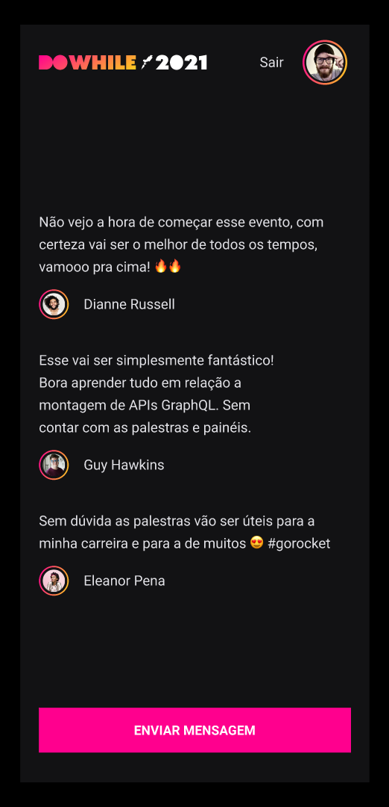

<h1 align="center"> <strong> Next Level Week 7ª Edição </strong> </h1>

<div align="center">
  </img>
</div>

<br />

<p align="center">Projeto <strong>IMPULSE</strong> - Rocketseat</p>

<div align="center">
  </img>
</div>

<br />

<p align="center">

  <a aria-label="Versão do React" href="#">
    </img>
  </a>

  <a aria-label="Versão do React Native" href="#">
    </img>
  </a>

  <a aria-label="Versão do Expo" href="#">
    </img>
  </a>

  <a aria-label="Versão do Node" href="#">
    </img>
  </a>
    
  <a aria-label="Rocketseat" href="#">
    </img>
  </a>

  <a aria-label="License" href="#">
    </img>
  </a>
</p>

<p align="center">
  <a href="#rocket-tecnologias">Tecnologias</a>&nbsp;&nbsp;&nbsp;|&nbsp;&nbsp;&nbsp;
  <a href="#-projeto">Projeto</a>&nbsp;&nbsp;&nbsp;|&nbsp;&nbsp;&nbsp;
  <a href="#-TelasApp">Telas das Aplicação</a>&nbsp;&nbsp;&nbsp;|&nbsp;&nbsp;&nbsp;
  <a href="#memo-licença">Licença</a>
</p>


## 💻 Projeto

Esta é uma aplicação demonstrativa, com o objetivo de divulgar o Evento DoWhile 2021 e demonstrar a utilização das ferramentas, linguagens e bibliotecas aqui utilizadas. :rocket.


## :rocket: Tecnologias

Este projeto foi desenvolvido durante a 7ª edição da Next Level Week Heat, e as tecnologias utilizadas foram:

- [Node.js](https://nodejs.org/en/)
- [React](https://reactjs.org)
- [React Native](https://facebook.github.io/react-native/)
- [Expo](https://expo.io/)


## Instalação
Para que o projeto funcione corretamente você deverá clonar o projeto em seu computador e configura-lo corretamente de acordo com os passo a passos a seguir.

### obs:
Lembre-se: **Verifique as portas que estão sendo utilizadas em seu computador, e caso seja necessário, configure as portas corretamente, para que não aja conflito entre seus projetos ou aplicações que já estejam em execução.**

### Dependências

##### Para Execução do -> Backend
Para instalar e executar o **Backend**, acesse a pasta backend com o seu terminal e em seguida execute:
```bash
yarn install
yarn dev

ou 

npm install
npm dev
```

##### Para Execução do ->  Frontend
Para instalar e executar o **Frontend**, acesse a pasta web com o seu terminal e em seguida execute:
```bash
yarn install
yarn start

ou 

npm install
npm dev
```
Assim que o processo terminar, você pode acessar através do endereço `localhost:3000` em seu navegador. 

##### Para Execução do ->  Mobile
Para executar a aplicação **Mobile**, acesse a pasta nlwheatapp e em seguida configure o endereço do servidor no arquivo `src/services/api.js`, de acordo com o seus parâmetros de rede "seu `ip`", e a porta configurada no backend, para que a aplicação mobile consiga acessa a base de dados, em seguida abra o terminal dentro da pasta mobile e depois execute os comandos:
```bash
# Caso ja possua o Expo (CLI) instalado! não execute  aprimeira linha de código
yarn global add install expo-cli
yarn install
yarn start
```
Assim que o processo finalizar, automagicamente será aberta uma página `localhost:19002` em seu navegador padrão. Conecte seu emulador, caso não o possua instalado e queira utiliza-lo estes links o ajudaram nesta tarefa, assim como uma explicação sobre o funcionamento do emulador, [Rocketseat Docs Emulador Mobile](https://docs.rocketseat.dev/ambiente-react-native/android/emulador), [Emulando React Native no iOS/Android com Expo](https://www.youtube.com/watch?v=eSjFDWYkdxM).

Caso queira testa a aplicação mobile via `LAN`: baixe o aplicativo *Expo* na Play Store ou App Store e em seguida escaneie o código QR que aparece no canto esquerdo inferior da página aberta no seu navegador padrão.

### obs:
Lembre-se: **Fique atento ao seu ip, sempre que executar a aplicação mobile, verifique se o ip `src/services/api.js` está correto, de acordo com o seu**.

## 🔖 TelasApp
Web -> resultado da aplicação em execução:

<br />

<div align="center">
  </img>
</div>

<br />

<table>
	<tr>
		<td>
			</img>
		</td>
    <td>
      </img>
    </td>
	</tr>
</table>

## Mobile
App Mobile (React Native) -> resultado da execução:
<table>
  <tr>
    <td>
      </img>
    </td>
    <td>
      </img>
    </td>
    <td>
      </img>
    </td>
  </tr>
</table>

## :memo: Licença

Esse projeto está sob a licença MIT. Veja o arquivo [LICENSE](LICENSE.md) para mais detalhes.
